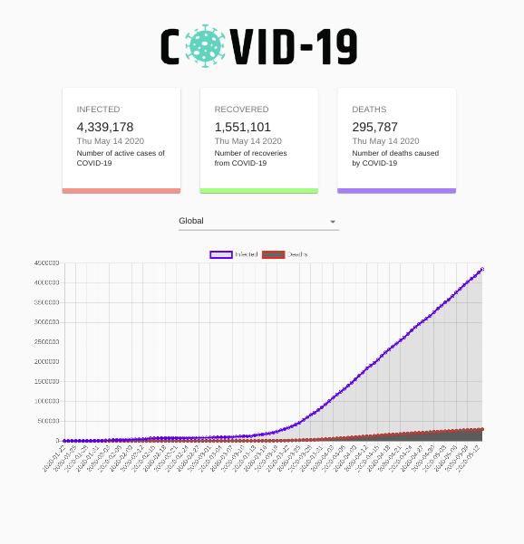

# COVID-19 Tracker

## Steps to setup

* Clone this repository to your local machine

* Change into the directory of the repository

* Run `npm install`, it will install all the required dependencies

* Then run `npm start`, it will run the project locally to your computer

### API used:

* `https://covid19.mathdro.id/api`

* `https://covid19.mathdro.id/api/daily`

* `https://covid19.mathdro.id/api/countries/${country}`
  * **Note: change _Country_ inside {} to name of any country to get the results.**
  

